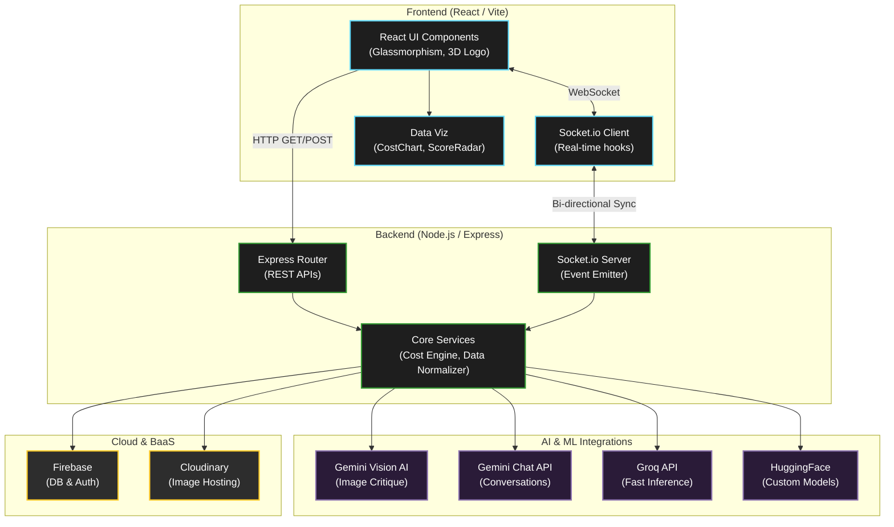

# GenArchAI 🏗️✨

<div align="center">
  <p><b>An advanced, AI-powered architectural design assistant and project workspace.</b></p>
  <p><i>Blending cutting-edge generative AI, real-time collaboration, and glassmorphism aesthetics to transform the way architectural projects are conceptualized and managed.</i></p>

  [](#)
  [](#)
  [](#)
  [](#)
  [](#)
  [](#)
</div>

<br />

## 📑 Table of Contents
1. [Overview](#-overview)
2. [Key Features](#-key-features)
3. [System Architecture](#-system-architecture)
4. [Tech Stack](#-tech-stack)
5. [Getting Started](#-getting-started)
6. [Environment Variables](#-environment-variables)
7. [Project Structure](#-project-structure)
8. [Future Enhancements](#-future-enhancements)

---

## 📖 Overview
GenArchAI is a full-stack platform designed to assist architects, students, and home renovators. By leveraging state-of-the-art AI models (Google Gemini, Groq, HuggingFace), it offers intelligent design critiques, automated budget estimations, version control for designs, and a real-time collaborative workspace. 

The frontend features a clean, minimalist design utilizing custom Glassmorphism components (`GlassCard.jsx`) and interactive visualizations (`CostChart.jsx`, `ScoreRadar.jsx`) for an unparalleled user experience.

---

## 🌟 Key Features

* **🤖 AI Architect Chat:** Context-aware design conversations and brainstorming powered by Google Gemini & Groq LLMs.
* **👁️ Generative Vision & Critique:** Upload blueprints or sketches and receive instant architectural critiques, structural insights, and improvement scores via Gemini Vision AI.
* **💰 Dynamic Budget Optimizer:** Automated cost estimation engine (`costEngine.js`) that analyzes design parameters to forecast material and labor expenses.
* **🔄 Real-Time Collaboration:** Powered by Socket.io, allowing multiple users to seamlessly interact within the `ProjectWorkspace`.
* **🕰️ Version History:** Keep track of design iterations, rollback changes, and maintain a robust audit trail of your architectural drafts.
* **🛠️ Renovation Studio:** Specialized module for uploading existing room layouts and generating AI-driven renovation suggestions.
* **☁️ Cloud Integration:** Secure image hosting with Cloudinary and robust backend services (Auth/DB) handled by Firebase.

---

## 🏗️ System Architecture

The following flowchart outlines the data flow and architectural structure of the GenArchAI platform:



---

## 💻 Tech Stack

### **Frontend**
* **Core:** React.js, Vite
* **Styling:** Custom CSS (Glassmorphism aesthetics, `.css` modules)
* **Real-time:** `socket.io-client`
* **Key Components:** Interactive charts, Loading Overlays, 3D Canvas Elements.

### **Backend**
* **Core:** Node.js, Express.js
* **Real-time:** `socket.io`
* **File Processing:** Image processing utilities

### **AI / Cloud Services**
* **LLM Providers:** Google Gemini, Groq, HuggingFace
* **Database & Auth:** Firebase
* **Media Storage:** Cloudinary

---

## 🚀 Getting Started

Follow these steps to set up the project locally.

### Prerequisites
* Node.js (v18 or higher recommended)
* npm or yarn package manager
* API Keys for Firebase, Cloudinary, Gemini, Groq, and HuggingFace.

### Installation

1.  **Clone the repository:**
    ```bash
    git clone [https://github.com/your-username/genarchai.git](https://github.com/your-username/genarchai.git)
    cd genarchai-1.1
    ```

2.  **Setup the Server:**
    ```bash
    cd server
    npm install
    # Set up your environment variables (see section below)
    npm start
    ```

3.  **Setup the Client:**
    ```bash
    cd ../client
    npm install
    npm run dev
    ```

4.  **Access the application:** Open `http://localhost:5173` in your browser.

---

## 🔐 Environment Variables

You will need to create a `.env` file in the `server/` directory. Use the provided `server/.env.example` as a template.

```env
# Server Configuration
PORT=5000

# Google Gemini API
GEMINI_API_KEY=your_gemini_api_key

# Groq API
GROQ_API_KEY=your_groq_api_key

# HuggingFace API
HF_API_KEY=your_huggingface_token

# Cloudinary
CLOUDINARY_CLOUD_NAME=your_cloud_name
CLOUDINARY_API_KEY=your_api_key
CLOUDINARY_API_SECRET=your_api_secret

# Firebase Admin SDK (Service Account JSON representation)
FIREBASE_PROJECT_ID=your_project_id
FIREBASE_CLIENT_EMAIL=your_client_email
FIREBASE_PRIVATE_KEY="your_private_key"
```

---

## 📁 Project Structure

```text
GenArchAI-1.1/
├── client/
│   ├── public/assets/         # Static assets (3D models, illustrations)
│   ├── src/
│   │   ├── api/               # Axios/fetch API client configurations
│   │   ├── components/        # Reusable UI (Navbar, GlassCard, Loading, Charts)
│   │   ├── hooks/             # Custom React hooks (e.g., useSocket.js)
│   │   ├── pages/             # Route views (Dashboard, RenovationStudio, etc.)
│   │   ├── App.jsx            # Main application router
│   │   └── main.jsx           # React DOM entry point
│   └── package.json
└── server/
    ├── routes/                # Express API routes (chat, cost, design, etc.)
    ├── services/              # 3rd-party integrations (Firebase, Gemini, Cloudinary)
    ├── utils/                 # Helper functions (dataNormalizer, imageProcessor)
    ├── index.js               # Express server entry point
    └── package.json
```

---

## 🔮 Future Enhancements
* **Mobile Responsiveness:** Further optimize the Glassmorphism UI for smaller screens.
* **Direct Export:** Export AI-generated blueprints and cost estimates to PDF/CSV.
* **Advanced 3D Previews:** Expand `Logo3D.jsx` capabilities into full architectural 3D object viewers using Three.js.

---
<div align="center">
  <i>Designed and developed for the future of architectural engineering.</i>
</div>
